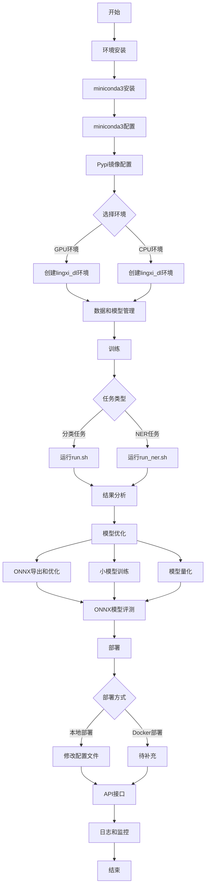

# 灵犀AI算法工程化解决方案


[English](README_EN.md) | [中文](README.md)

本项目是一个基于BERT模型的深度学习的文本分类和命名实体识别(NER)系统,旨在处理和分析中文文本数据，项目涵盖算法的数据标记、训练、评估、优化等步骤。

## 目录
- [项目概述](#项目概述)
- [功能特性](#功能特性)
- [总体流程](#总体流程)
- [使用的第三方库和工具](#使用的第三方库和工具)
- [环境安装](#环境安装)
- [数据和模型管理](#数据和模型管理)
- [训练](#训练)
- [结果分析](#结果分析)
- [模型优化](#模型优化)
- [部署](#部署)
- [API接口](#api接口)
- [日志和监控](#日志和监控)
- [贡献指南](#贡献指南)
- [许可证](#许可证)

## 项目概述

灵犀AI算法中台以BERT模型为核心，构造的从数据标注、模型训练、模型评估、模型优化、模型部署、模型发布等流程，为AI应用提供一套完整的解决方案。

此算法中台适用主要适用如下场景，且针对性地内置了一系列的工具和优化方案。：

1. 文本分类（句子分类）
2. 命名实体识别（NER）、Token分类


## 功能特性

- 支持分类和NER任务
- 数据和模型版本控制
- 模型训练和优化
- 本地和Docker部署选项
- API接口提供
- 日志记录和监控功能

## 总体流程



## 使用的第三方库和工具


| 环节 | 第三方工具 |
|------|------------|
| 环境管理 | miniconda3, Anaconda |
| 包管理 | conda, pip |
| 数据和模型版本控制 | DVC |
| 训练框架 | Hugging Face Transformers |
| 训练可视化 | Weights & Biases (wandb) |
| 模型优化 | ONNX Runtime |
| 模型部署 | FastAPI |
| 容器化 | Docker |
| 监控 | Prometheus, Grafana |
| 日志管理 | Python logging 模块 |
| 数据分析 | matplotlib (用于数据集修正) |
| API测试 | requests (Python库) |


## 环境安装

首次使用时配置

### 前提条件

- 硬件要求:
  - CPU: 主流CPU即可
  - RAM: 至少16GB,推荐32GB或更高
  - GPU: 推荐NVIDIA GTX 1080Ti或更高(用于GPU训练)
- 操作系统: Ubuntu 18.04或更高版本,Windows 10或更高版本,MacOS等
- Python 3.8+
- CUDA 11.8+(用于GPU训练,可选)

#### 配置 MinIO

若需要启用数据和模型的版本管理，还需要配置 MinIO 系统，用于存储和传输数据。

MinIO 是一个对象存储解决方案，提供与亚马逊网页服务 S3 兼容的 API，并支持所有核心 S3 功能。

官方配置指南：

* [Linux](https://min.io/docs/minio/linux/operations/install-deploy-manage/deploy-minio-single-node-single-drive.html)
* [MacOS](https://min.io/docs/minio/macos/operations/install-deploy-manage/deploy-minio-single-node-single-drive.html)
* [Windows](https://min.io/docs/minio/windows/operations/install-deploy-manage/deploy-minio-single-node-single-drive.html)


### miniconda3安装

基于清华大学的miniconda3镜像

Anaconda安装文件路径：https://mirrors.tuna.tsinghua.edu.cn/anaconda/miniconda/

请从中选择最新的合适当前系统的文件版本进行安装。

### miniconda3配置

#### 初始化环境

1. Windows 系统

进入"开始"菜单->"miniconda3"->"Anaconda Prompt (miniconda3)"，输入：

```shell
conda init powershell
```
即可在今后的`powershell`终端中，直接使用conda了

2. Linux 系统

进入`conda`默认安装目录后，执行下列语句

```bash
cd bin
conda init
```

如果使用的是非Bash的shell，则需要手动进行以下操作：

进入`$HOME/.bashrc`中，将

```bash
# >>> conda initialize >>>
# <<< conda initialize <
```
之间的内容拷贝下来，粘贴至目前使用的Shell的配置文件的结尾，执行`source`语句激活配置。

完成上述操作后，在终端的最左侧将会有一个`(base)`出现，若没有，则说明配置为生效，请咨询同事。

#### 镜像加速

由于网络原因，默认的安装仓库连接速度缓慢，因此需要使用国内镜像仓库

Linux用户可以通过修改用户目录下的`.condarc`文件，默认位置为：`$HOME/.condarc`

Windows 用户无法直接创建名为`.condarc`的文件，可执行下列命令生成对应文件,默认位置为：`$USER/.condarc`

```bash
conda config --set show_channel_urls yes
```

清除`.condarc`文件中所有的内容，复制如下内容：

```yaml
channels:
  - defaults
show_channel_urls: true
default_channels:
  - https://mirrors.tuna.tsinghua.edu.cn/anaconda/pkgs/main
  - https://mirrors.tuna.tsinghua.edu.cn/anaconda/pkgs/r
  - https://mirrors.tuna.tsinghua.edu.cn/anaconda/pkgs/msys2
custom_channels:
  conda-forge: https://mirrors.tuna.tsinghua.edu.cn/anaconda/cloud
  pytorch: https://mirrors.tuna.tsinghua.edu.cn/anaconda/cloud
  nvidia: https://mirrors.sustech.edu.cn/anaconda-extra/cloud
```

即可添加 Anaconda Python 镜像仓库。

配置完成可运行 `conda clean -i` 清除索引缓存。

若想添加其他第三方源，可参考：[Anaconda镜像源配置](https://mirrors.tuna.tsinghua.edu.cn/help/anaconda/)

**注意：** 镜像加速只针对国内用户，外网用户请使用官方镜像。

### Pypi镜像配置

```bash
pip config set global.index-url https://mirrors.aliyun.com/pypi/simple/
```

### GPU 环境创建（基于Anaconda）

环境要求：
脚本会创建一个名为`lingxi_dl`的conda环境

```bash
conda deactivate
conda env create -f create_env/env-GPU.yml
conda activate lingxi_dl
pip install -r create_env/requirements-GPU.txt -i https://mirrors.aliyun.com/pypi/simple/
```

### CPU环境(模型开发和代码调试)

```bash
conda deactivate
conda env create -f create_env/env-CPU.yml
conda activate lingxi_dl
pip install -r create_env/requirements-CPU.txt -i https://mirrors.aliyun.com/pypi/simple/
```

## 数据和模型管理


该项目默认使用DVC(Data Version Control)模块，用于对模型和数据进行管理，可参考[DVC指南](https://dvc.org/doc/start/data-versioning)

配置DVC初始化脚本`bash init_dvc.sh`，完成后执行脚本进行DVC的初始化。

将下面两行命令添加至环境变量中
```.env
# 最好将下面两个变量设置添加至环境变量中
export AWS_SECRET_ACCESS_KEY="IO1UOMtGn4eN5rzGNzOGKPOU6n8metxq"
export AWS_ACCESS_KEY_ID="minio"
```

### 1. 数据和模型上传

不论是添加和修改文件都需要执行下面的命令

```bash
dvc add 模型或者数据文件
git add 对应生成的*.dvc文件（具体可参见上条命令的末尾说明）
dvc commit
git commit -am "提交说明"
dvc push
git push
```

### 2. 数据和模型拉取
```bash
git pull
dvc pull
```

### 3. 数据和模型的删除
```bash
dvc remove 需要删除的对应的*.dvc文件
dvc commit
git commit -am "提交说明"
dvc push
git push
```
### 4. 数据和模型的版本切换
```bash
git checkout <...>
dvc checkout
```


### 训练数据格式

**注**：数据中确保不存在空数据的问题，以及出现`nan`这样的字段，否则的话，分词的时候会处理错误

#### 分类问题

数据表头为

* `index	sentence	label`

数据和表头中间用`\t`分隔

*train.tsv*
```text
index	sentence	label
0	这是一个例句。	0
1	这是一个例句。	0
2	这是一个例句。	0
3	这是一个例句。	0
```

*dev.tsv*
```text
index	sentence	label
0	这是一个例句。	0
1	这是一个例句	0
2	这是一个例句。	0
3	这是一个例句。	0
```

*test.tsv*
```text
index	sentence	label
0	这是一个例句。	0
1	这是一个例句	0
2	这是一个例句。	0
3	这是一个例句。	0
```

#### NER问题

请将将数据文件存储至`data/ner`目录中

数据分为两列，第一列为单字，第二列为标签，中间用` `（空格）隔开，不同条数据之间用**空行**隔开

*train.txt*

```text
东 B-说话人
郭 I-说话人
宇 I-说话人
露 O
出 O
无 O
奈 O
的 O
苦 O
笑 O
： O
" O
如 O
果 O
我 O
说 O
我 O
是 O
担 O
心 O
那 O
只 O
半 O
妖 O

在 O
队 O
员 O
们 O
下 O
车 O
了 O
以 O
后 O
， O
何 B-说话人
云 I-说话人
教 I-说话人
练 I-说话人
对 O
大 O
家 O
说 O
道 O
： O
" O
这 O
之 O
后 O
我 O
就 O
没 O
法 O
陪 O
着 O
你 O
们 O
了 O
， O
诸 O
位 O
多 O
努 O
力 O
吧 O
. O
. O
. O
. O
. O
. O
噗 O
嗤 O
。 O
" O
```

在`data/ner/lingxi_ner.py`文件中，修改下列注释位置
```python
def _info(self):
    return datasets.DatasetInfo(
        description=_DESCRIPTION,
        features=datasets.Features(
            {
                "id": datasets.Value("string"),
                "tokens": datasets.Sequence(datasets.Value("string")),
                "ner_tags": datasets.Sequence(
                    datasets.features.ClassLabel(
                        # 此处修改NER标签
                        names=[
                            "O",
                            "B-说话人",
                            "I-说话人",
                        ]
                    )
                ),
            }
        ),
        supervised_keys=None,
        homepage="",
    )
```

**数据集记得及时使用DVC命令进行版本控制！！！**

## 训练

基于huggingface的transformers的example修改

### 训练参数介绍


重要训练参数说明:

* --model_name_or_path: 预训练模型的路径或名称
* --train_file: 训练数据文件路径
* --validation_file: 验证数据文件路径
* --per_device_train_batch_size: 每个设备的训练批次大小
* --learning_rate: 学习率
* --num_train_epochs: 训练轮数
* --output_dir: 模型输出目录

详见 [模型参数说明](模型参数.md)

注：训练参数中

* `--do_train` 是进行训练，在`output_dir`中会生成`all_results.json`文件记录训练结果
* `--do_eval` 是进行测试，在`output_dir`中会生成`all_results.json`文件记录训练结果
* `--do_predict` 是进行预测，会在`output_dir`中生成一份`predict_results`开头的预测文件，其中包含预测结果和对应的概率值

这三个参数可以单独使用，也可以共同使用。

### 模型运行结果可视化

除了命令行会输出一份模型的结果之外，基于wandb也会输出一份结果进行可视化展示

wandb的具体使用方法参考：[wandb: 深度学习轻量级可视化工具入门教程](https://blog.csdn.net/qq_40507857/article/details/112791111)

注：只需要在命令行登录wandb即可，当前框架已经自动插入wandb对应的代码

### 分类

参考链接：[text-classification](https://github.com/huggingface/transformers/tree/main/examples/pytorch/text-classification)

训练脚本`run.sh`

* wandb 项目名称默认为当前文件夹名称
* 模型默认使用`hfl/chinese-bert-wwm-ext`BERT模型作为初始化模型
* 训练结果默认存储在`result`文件夹中

#### 数据集修正
本方法基于论文：Swayamdipta, Swabha, Roy Schwartz, Nicholas Lourie, Yizhong Wang, Hannaneh Hajishirzi, Noah A. Smith和Yejin Choi. 《Dataset Cartography: Mapping and Diagnosing Datasets with Training Dynamics》. 收入 Proceedings of the 2020 Conference on Empirical Methods in Natural Language Processing (EMNLP), 9275–93. Online: Association for Computational Linguistics, 2020. https://doi.org/10.18653/v1/2020.emnlp-main.746.

使用方法：

1. 进入`data_analyse`目录，修改`run.sh`脚本中对应参数，运行`run.sh`脚本
2. 进入`selection`目录，修改`generate.sh`脚本中对应模型输出目录，运行`generate.sh`脚本
3. 进入`cartography`目录，可以看到名为`SNLI_bert.pdf`的文件，即最终的数据分布图
4. 进入模型输入目录，打开`td_metrics.jsonl`文件，即为当前训练集数据的统计结果

各个统计指标含义：

* confidence：正确标签的概率均值
* variability：正确标签的概率方差
* correctness：模型预测正确的次数


### NER

训练脚本`run_ner.sh`

* wandb 项目名称默认为当前文件夹名称
* 模型默认使用`hfl/chinese-bert-wwm-ext`BERT模型作为初始化模型
* 训练结果默认存储在`result`文件夹中

## 结果分析

对于分类任务:
1. 准确率、精确率、召回率和F1分数分析
2. 混淆矩阵可视化
3. 错误案例分析

对于NER任务:
1. 实体级别的精确率、召回率和F1分数
2. 不同类型实体的性能分析
3. 边界检测准确性分析
4. 错误案例和错误类型分析

使用`scripts/analyze_results.py`脚本进行详细分析。

## 模型优化

**注：以下过程必须进行评价指标的比较！！！**

### ONNX导出和优化

根据当前任务类型，选择`optimize/export_onnx_cls.py`或者`optimize/export_onnx_ner.py`脚本进行ONNX文件导出，

具体命令如下:
```bash
python optimize/export_onnx_cls.py [模型文件所在的文件夹路径] [输出的ONNX文件路径]
```

再编辑`optimize/optimize.sh`中的`raw.onnx`名字替换为导出的ONNX文件名，执行`bash optimize/optimize.sh`命令，对模型进行图融合和FP16导出

### 小模型训练

若任务比较简单，可以尝试使用小模型直接进行训练和优化。

1. 选择合适的小型预训练模型(如`rbt3`, `rbtl3`, `rbt4`, `rbt6`)
2. 调整训练参数:
   - 增加`num_train_epochs`到5或更多
   - 增加`per_device_train_batch_size`到64或更高
3. 运行训练脚本并监控性能
4. 比较小模型与大模型的性能权衡

### 模型量化

参考：https://onnxruntime.ai/docs/performance/quantization.html

模型量化过程主要将权重转换为INT8，在最终指标损失0.1~0.3%的基础上，提升模型推理速度，目前只能用于CPU服务器，GPU服务部署无法使用

使用方法：

执行`optimize/quantize.py`命令，例如
```bash
python optimize/quantize.py [需要量化的模型路径] [量化后的ONNX文件路径]
```

### ONNX 模型评测

对于优化后模型，需要进行评测，得出每次优化后的评价指标的变化，用于最终的模型决策

使用方法：

执行`optimize/evaluate_onnx_cls.py`（分类模型的指标评测）或`optimize/evaluate_onnx_ner.py`（NER模型指标评测），例如

```bash
python optimize/evaluate_onnx_cls.py [测试数据集文件路径] [模型生成预测结果文件路径] [ONNX文件路径]
```


## 部署

模型服务框架基于fastapi构建，使用ONNXRuntime部署，支持docker部署方式。

部署服务内置组件：

1. 文件日志模块
2. cache 接口缓存模块
3. sentry 异常监控模块
4. prometheus 监控模块

以上组件均为可选，可在`deploy/api/factory.py`中进行配置


**注意** 以下操作均在`deploy`文件夹中完成

**注意** 

为了兼顾模型性能和最终处理的准确性，设计了两种文本预处理模式

* 截断：直接将文本超出最大长度126字的内容进行截断，不处理超出部分的内容
* 超长文本：待处理的单行文本字数超过设定的最大长度126字，但是又希望能够处理超出部分的长度的内容，从中提取相关实体

分类任务默认使用**截断**模式，NER任务默认使用**超长文本**模式

若需要对此进行修改，需要在数据进入预处理步骤前，控制文本的长度

### 本地部署

分类任务：

1. 修改`deploy/api/config.py`文件，根据注释填写对应变量
2. 进入`deploy/api/routers/classify.py`文件
3. 修改`@router.post('/', response_model=ClassifyResult)`的`/`处内容，作为接口路径

NER任务：

1. 修改`deploy/api/config.py`文件，根据注释填写对应变量
2. 进入`deploy/api/routers/ner.py`文件
3. 修改如下内容：

```python
## 修改为此次使用的BIO实体
label_list = ['O', 'B-说话人', 'I-说话人  ']
# 根据接口文档，修改接口路径
@router.post('/novel/shr', response_model=NerResult)
```

### Docker 部署

[待补充Docker部署的详细步骤]

## API接口

### CLS 分类接口

#### Request

`type`和`debug`参数一般省略不写，如果写了可能会有问题，具体用法参考代码

```python
import requests
import json

url = "0.0.0.0:8000/oneline"

payload = json.dumps({
  "type":"chi",
  "debug":False,
  "texts": [
    "今天我上街"
  ]
})
headers = {
  'Content-Type': 'application/json'
}

response = requests.request("POST", url, headers=headers, data=payload)

print(response.text)
```

## NER 实体识别接口

#### Request

同CLS接口

#### Response
- Body
```json
{
    "speakers": [
        []
    ],
    "roles": [
        [
            {
                "start": 0,
                "end": 3,
                "text": "方文达"
            }
        ]
    ]
}
```

## 日志和监控

日志配置文件为`deploy/logging_config.json`，默认的日志文件名为`access.log`，可以根据需要对日志配置进行修改

监控接口采用`Prometheus`完成，配置步骤如下：

1. 在对应的`prometheus.yml`的`job_name: 'dl_mode'`中，添加当前服务的IP和端口地址
2. 在`grafana`界面中，添加当前服务对应的监控界面


## 贡献指南


我们欢迎所有形式的贡献,包括但不限于:

1. 报告问题和建议
2. 提交代码改进
3. 改进文档
4. 添加新功能

贡献步骤:
1. Fork 项目仓库
2. 创建你的特性分支 (`git checkout -b feature/AmazingFeature`)
3. 提交你的改动 (`git commit -m 'Add some AmazingFeature'`)
4. 推送到分支 (`git push origin feature/AmazingFeature`)
5. 开启一个 Pull Request

代码规范:
- 遵循 PEP 8 编码规范
- 添加适当的注释和文档字符串
- 确保所有测试通过


## 许可证

本项目采用 Apache 2.0 许可证。详情请见 [LICENSE](LICENSE) 文件。