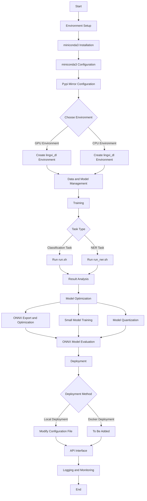

# Lingxi AI Algorithm Engineering Solution


[English](README_EN.md) | [中文](README.md)

This project is a deep learning-based text classification and named entity recognition (NER) system using the BERT model, designed to process and analyze Chinese text data. The project covers various steps of algorithm development including data labeling, training, evaluation, and optimization.

## Table of Contents
- [Project Overview](#project-overview)
- [Features](#features)
- [Overall Process](#overall-process)
- [Third-Party Libraries and Tools Used](#third-party-libraries-and-tools-used)
- [Environment Setup](#environment-setup)
- [Data and Model Management](#data-and-model-management)
- [Training](#training)
- [Result Analysis](#result-analysis)
- [Model Optimization](#model-optimization)
- [Deployment](#deployment)
- [API Interface](#api-interface)
- [Logging and Monitoring](#logging-and-monitoring)
- [Contribution Guidelines](#contribution-guidelines)
- [License](#license)

## Project Overview

The Lingxi AI algorithm platform is centered around the BERT model, constructing a process from data annotation, model training, model evaluation, model optimization, model deployment, to model release, providing a complete solution for AI applications.

This algorithm platform is primarily applicable to the following scenarios, and includes a series of built-in tools and optimization solutions:

1. Text classification (sentence classification)
2. Named Entity Recognition (NER), Token classification

## Features

- Support for classification and NER tasks
- Data and model version control
- Model training and optimization
- Local and Docker deployment options
- API interface provision
- Logging and monitoring functionality


## Overall Process



## Third-Party Libraries and Tools Used

| Stage | Third-Party Tools |
|-------|-------------------|
| Environment Management | miniconda3, Anaconda |
| Package Management | conda, pip |
| Data and Model Version Control | DVC |
| Training Framework | Hugging Face Transformers |
| Training Visualization | Weights & Biases (wandb) |
| Model Optimization | ONNX Runtime |
| Model Deployment | FastAPI |
| Containerization | Docker |
| Monitoring | Prometheus, Grafana |
| Logging Management | Python logging module |
| Data Analysis | matplotlib (for dataset correction) |
| API Testing | requests (Python library) |


## Environment Setup

Configuration for first-time use

### Prerequisites

- Hardware requirements:
  - CPU: Mainstream CPU is sufficient
  - RAM: At least 16GB, 32GB or higher recommended
  - GPU: NVIDIA GTX 1080Ti or higher recommended (for GPU training)
- Operating System: Ubuntu 18.04 or higher, Windows 10 or higher, MacOS, etc.
- Python 3.8+
- CUDA 11.8+ (for GPU training, optional)

#### Configuring MinIO

If you need to enable version management for data and models, you also need to configure the MinIO system for storing and transferring data.

MinIO is an object storage solution that provides an API compatible with Amazon Web Services S3 and supports all core S3 functionalities.

Official configuration guide:

* [Linux](https://min.io/docs/minio/linux/operations/install-deploy-manage/deploy-minio-single-node-single-drive.html)
* [MacOS](https://min.io/docs/minio/macos/operations/install-deploy-manage/deploy-minio-single-node-single-drive.html)
* [Windows](https://min.io/docs/minio/windows/operations/install-deploy-manage/deploy-minio-single-node-single-drive.html)

### miniconda3 Installation

Based on Tsinghua University's miniconda3 mirror

Anaconda installation file path: https://mirrors.tuna.tsinghua.edu.cn/anaconda/miniconda/

Please select the latest file version suitable for your current system for installation.

### miniconda3 Configuration

#### Initialize Environment

1. Windows System

Go to "Start" menu -> "miniconda3" -> "Anaconda Prompt (miniconda3)", enter:

```shell
conda init powershell
```
You can now use conda directly in the `powershell` terminal in the future

2. Linux System

After entering the default installation directory of `conda`, execute the following statement

```bash
cd bin
conda init
```

If you're using a non-Bash shell, you need to manually perform the following operations:

Enter `$HOME/.bashrc`, copy the content between

```bash
# >>> conda initialize >>>
# <<< conda initialize 
```
Paste it at the end of the configuration file of the Shell you're currently using, execute the `source` statement to activate the configuration.

After completing the above operations, a `(base)` will appear on the far left of the terminal. If not, the configuration is not effective, please consult your colleagues.

#### Mirror Acceleration

Due to network reasons, the default installation repository connection speed is slow, so you need to use domestic mirror repositories

Linux users can modify the `.condarc` file in the user directory, the default location is: `$HOME/.condarc`

Windows users cannot directly create a file named `.condarc`, you can execute the following command to generate the corresponding file, the default location is: `$USER/.condarc`

```bash
conda config --set show_channel_urls yes
```

Clear all content in the `.condarc` file, copy the following content:

```yaml
channels:
  - defaults
show_channel_urls: true
default_channels:
  - https://mirrors.tuna.tsinghua.edu.cn/anaconda/pkgs/main
  - https://mirrors.tuna.tsinghua.edu.cn/anaconda/pkgs/r
  - https://mirrors.tuna.tsinghua.edu.cn/anaconda/pkgs/msys2
custom_channels:
  conda-forge: https://mirrors.tuna.tsinghua.edu.cn/anaconda/cloud
  pytorch: https://mirrors.tuna.tsinghua.edu.cn/anaconda/cloud
  nvidia: https://mirrors.sustech.edu.cn/anaconda-extra/cloud
```

This will add the Anaconda Python mirror repository.

After configuration, you can run `conda clean -i` to clear the index cache.

If you want to add other third-party sources, you can refer to: [Anaconda Mirror Source Configuration](https://mirrors.tuna.tsinghua.edu.cn/help/anaconda/)

**Note:** Mirror acceleration is only for domestic users, overseas users please use the official mirror.

### Pypi Mirror Configuration

```bash
pip config set global.index-url https://mirrors.aliyun.com/pypi/simple/
```

### GPU Environment Creation (Based on Anaconda)

Environment requirements:
The script will create a conda environment named `lingxi_dl`

```bash
conda deactivate
conda env create -f create_env/env-GPU.yml
conda activate lingxi_dl
pip install -r create_env/requirements-GPU.txt -i https://mirrors.aliyun.com/pypi/simple/
```

### CPU Environment (for model development and code debugging)

```bash
conda deactivate
conda env create -f create_env/env-CPU.yml
conda activate lingxi_dl
pip install -r create_env/requirements-CPU.txt -i https://mirrors.aliyun.com/pypi/simple/
```

## Data and Model Management

This project uses the DVC (Data Version Control) module by default for model and data management. You can refer to the [DVC Guide](https://dvc.org/doc/start/data-versioning)

Configure the DVC initialization script `bash init_dvc.sh`, then execute the script to initialize DVC.

Add the following two command lines to your environment variables
```.env
# It's best to add the following two variable settings to your environment variables
export AWS_SECRET_ACCESS_KEY="IO1UOMtGn4eN5rzGNzOGKPOU6n8metxq"
export AWS_ACCESS_KEY_ID="minio"
```

### 1. Data and Model Upload

Whether adding or modifying files, you need to execute the following commands

```bash
dvc add model or data file
git add corresponding generated *.dvc files (refer to the end of the previous command for specifics)
dvc commit
git commit -am "commit description"
dvc push
git push
```

### 2. Data and Model Pull
```bash
git pull
dvc pull
```

### 3. Data and Model Deletion
```bash
dvc remove corresponding *.dvc file to be deleted
dvc commit
git commit -am "commit description"
dvc push
git push
```
### 4. Data and Model Version Switching
```bash
git checkout <...>
dvc checkout
```

### Training Data Format

**Note**: Ensure there are no empty data problems in the data, and no fields such as `nan` appear, otherwise there will be errors in word segmentation

#### Classification Problem

The data header is

* `index	sentence	label`

Data and headers are separated by `\t`

*train.tsv*
```text
index	sentence	label
0	This is an example sentence.	0
1	This is an example sentence.	0
2	This is an example sentence.	0
3	This is an example sentence.	0
```

*dev.tsv*
```text
index	sentence	label
0	This is an example sentence.	0
1	This is an example sentence	0
2	This is an example sentence.	0
3	This is an example sentence.	0
```

*test.tsv*
```text
index	sentence	label
0	This is an example sentence.	0
1	This is an example sentence	0
2	This is an example sentence.	0
3	This is an example sentence.	0
```

#### NER Problem

Please store the data files in the `data/ner` directory

The data is divided into two columns, the first column is a single character, the second column is the label, separated by ` ` (space), different data items are separated by **blank lines**

*train.txt*

```text
东 B-说话人
郭 I-说话人
宇 I-说话人
露 O
出 O
无 O
奈 O
的 O
苦 O
笑 O
： O
" O
如 O
果 O
我 O
说 O
我 O
是 O
担 O
心 O
那 O
只 O
半 O
妖 O

在 O
队 O
员 O
们 O
下 O
车 O
了 O
以 O
后 O
， O
何 B-说话人
云 I-说话人
教 I-说话人
练 I-说话人
对 O
大 O
家 O
说 O
道 O
： O
" O
这 O
之 O
后 O
我 O
就 O
没 O
法 O
陪 O
着 O
你 O
们 O
了 O
， O
诸 O
位 O
多 O
努 O
力 O
吧 O
. O
. O
. O
. O
. O
. O
噗 O
嗤 O
。 O
" O
```

In the `data/ner/lingxi_ner.py` file, modify the following commented position
```python
def _info(self):
    return datasets.DatasetInfo(
        description=_DESCRIPTION,
        features=datasets.Features(
            {
                "id": datasets.Value("string"),
                "tokens": datasets.Sequence(datasets.Value("string")),
                "ner_tags": datasets.Sequence(
                    datasets.features.ClassLabel(
                        # Modify NER labels here
                        names=[
                            "O",
                            "B-说话人",
                            "I-说话人",
                        ]
                    )
                ),
            }
        ),
        supervised_keys=None,
        homepage="",
    )
```

**Remember to use DVC commands for version control of the dataset in a timely manner!!!**

## Training

Modified based on huggingface's transformers example

### Training Parameter Introduction

Important training parameter explanations:

* --model_name_or_path: Path or name of the pre-trained model
* --train_file: Path of the training data file
* --validation_file: Path of the validation data file
* --per_device_train_batch_size: Training batch size per device
* --learning_rate: Learning rate
* --num_train_epochs: Number of training epochs
* --output_dir: Model output directory

See [Model Parameter Description](模型参数.md) for details

Note: In the training parameters

* `--do_train` is for training, it will generate an `all_results.json` file in the `output_dir` to record the training results
* `--do_eval` is for testing, it will generate an `all_results.json` file in the `output_dir` to record the training results
* `--do_predict` is for prediction, it will generate a prediction file starting with `predict_results` in the `output_dir`, which includes prediction results and corresponding probability values

These three parameters can be used separately or together.

### Model Run Result Visualization

In addition to outputting a copy of the model results in the command line, a copy of the results will also be output based on wandb for visualization

For specific usage of wandb, refer to: [wandb: Deep Learning Lightweight Visualization Tool Getting Started Tutorial](https://blog.csdn.net/qq_40507857/article/details/112791111)

Note: You only need to log in to wandb in the command line, the current framework has automatically inserted the corresponding code for wandb

### Classification

Reference link: [text-classification](https://github.com/huggingface/transformers/tree/main/examples/pytorch/text-classification)

Training script `run.sh`

* The wandb project name defaults to the current folder name
* The model uses the `hfl/chinese-bert-wwm-ext` BERT model as the initialization model by default
* Training results are stored in the `result` folder by default

#### Dataset Correction
This method is based on the paper: Swayamdipta, Swabha, Roy Schwartz, Nicholas Lourie, Yizhong Wang, Hannaneh Hajishirzi, Noah A. Smith, and Yejin Choi. 'Dataset Cartography: Mapping and Diagnosing Datasets with Training Dynamics'. In Proceedings of the 2020 Conference on Empirical Methods in Natural Language Processing (EMNLP), 9275–93. Online: Association for Computational Linguistics, 2020. https://doi.org/10.18653/v1/2020.emnlp-main.746.

Usage method:

1. Enter the `data_analyse` directory, modify the corresponding parameters in the `run.sh` script, run the `run.sh` script
2. Enter the `selection` directory, modify the corresponding model output directory in the `generate.sh` script, run the `generate.sh` script
3. Enter the `cartography` directory, you can see a file named `SNLI_bert.pdf`, which is the final data distribution map
4. Enter the model input directory, open the `td_metrics.jsonl` file, which is the statistical result of the current training set data

The meanings of various statistical indicators:

* confidence: The mean probability of the correct label
* variability: The variance of the probability of the correct label
* correctness: The number of times the model predicts correctly

### NER

Training script `run_ner.sh`

* The wandb project name defaults to the current folder name
* The model uses the `hfl/chinese-bert-wwm-ext` BERT model as the initialization model by default
* Training results are stored in the `result` folder by default

## Result Analysis

For classification tasks:
1. Accuracy, precision, recall, and F1 score analysis
2. Confusion matrix visualization
3. Error case analysis

For NER tasks:
1. Entity-level precision, recall, and F1 score
2. Performance analysis of different entity types
3. Boundary detection accuracy analysis
4. Error case and error type analysis

Use the `scripts/analyze_results.py` script for detailed analysis.

## Model Optimization

**Note: The following process must include a comparison of evaluation metrics!!!**

### ONNX Export and Optimization

According to the current task type, choose `optimize/export_onnx_cls.py` or `optimize/export_onnx_ner.py` script to export ONNX files,

The specific command is as follows:
```bash
python optimize/export_onnx_cls.py [path to the folder containing the model file] [output ONNX file path]
```

Then edit the `raw.onnx` name in `optimize/optimize.sh` to replace it with the exported ONNX file name, execute the `bash optimize/optimize.sh` command to perform graph fusion and FP16 export on the model

### Small Model Training

If the task is relatively simple, you can try to use a small model for direct training and optimization.

1. Choose a suitable small pre-trained model (such as `rbt3`, `rbtl3`, `rbt4`, `rbt6`)
2. Adjust training parameters:
   - Increase `num_train_epochs` to 5 or more
   - Increase `per_device_train_batch_size` to 64 or higher
3. Run the training script and monitor performance
4. Compare the performance trade-offs between small and large models

### Model Quantization

Reference: https://onnxruntime.ai/docs/performance/quantization.html

The model quantization process mainly converts weights to INT8, improving model inference speed while maintaining a final metric loss of 0.1~0.3%. Currently, it can only be used on CPU servers, and GPU service deployment is not supported.

Usage:

Execute the `optimize/quantize.py` command, for example:
```bash
python optimize/quantize.py [path to the model to be quantized] [path to the quantized ONNX file]
```

### ONNX Model Evaluation

For optimized models, evaluation is required to determine the changes in evaluation metrics after each optimization, which is used for final model decision-making.

Usage:

Execute `optimize/evaluate_onnx_cls.py` (evaluation of classification model metrics) or `optimize/evaluate_onnx_ner.py` (evaluation of NER model metrics), for example:

```bash
python optimize/evaluate_onnx_cls.py [path to the test dataset file] [path to the model prediction results file] [path to the ONNX file]
```

## Deployment

The model service framework is built on FastAPI and deployed using ONNXRuntime, supporting Docker deployment.

Built-in components in the deployment service:

1. File logging module
2. Cache interface caching module
3. Sentry exception monitoring module
4. Prometheus monitoring module

All components are optional and can be configured in `deploy/api/factory.py`.

**Note** All operations below are performed in the `deploy` folder.

**Note** 

To balance model performance and the accuracy of final processing, two text preprocessing modes are designed:

* Truncation: Directly truncate the content that exceeds the maximum length of 126 characters, without processing the excess part.
* Long Text: The single-line text to be processed exceeds the set maximum length of 126 characters, but it is hoped to process the content that exceeds the length, extracting relevant entities.

The classification task defaults to the **Truncation** mode, and the NER task defaults to the **Long Text** mode.

If you need to modify this, you need to control the length of the text before the preprocessing step.

### Local Deployment

Classification Task:

1. Modify the `deploy/api/config.py` file, fill in the corresponding variables according to the comments.
2. Enter the `deploy/api/routers/classify.py` file.
3. Modify the content of `@router.post('/', response_model=ClassifyResult)` at `/` to serve as the interface path.

NER Task:

1. Modify the `deploy/api/config.py` file, fill in the corresponding variables according to the comments.
2. Enter the `deploy/api/routers/ner.py` file.
3. Modify the following content:

```python
## Modify to the BIO entity used this time
label_list = ['O', 'B-说话人', 'I-说话人  ']
# Modify the interface path according to the interface documentation
@router.post('/novel/shr', response_model=NerResult)
```

### Docker Deployment

[Detailed steps for Docker deployment to be added]

## API Interface

### CLS Classification Interface

#### Request

The `type` and `debug` parameters are generally omitted. If written, there may be issues. Refer to the code for specific usage.

```python
import requests
import json

url = "0.0.0.0:8000/oneline"

payload = json.dumps({
  "type":"chi",
  "debug":False,
  "texts": [
    "今天我上街"
  ]
})
headers = {
  'Content-Type': 'application/json'
}

response = requests.request("POST", url, headers=headers, data=payload)

print(response.text)
```

## NER Entity Recognition Interface

#### Request

Same as the CLS interface.

#### Response
- Body
```json
{
    "speakers": [
        []
    ],
    "roles": [
        [
            {
                "start": 0,
                "end": 3,
                "text": "方文达"
            }
        ]
    ]
}
```

## Logging and Monitoring

The logging configuration file is `deploy/logging_config.json`, and the default log file name is `access.log`. You can modify the logging configuration as needed.

The monitoring interface is completed using `Prometheus`. The configuration steps are as follows:

1. In the corresponding `prometheus.yml`, add the IP and port address of the current service under `job_name: 'dl_mode'`.
2. In the `grafana` interface, add the monitoring interface corresponding to the current service.

## Contribution Guide

We welcome all forms of contributions, including but not limited to:

1. Reporting issues and suggestions
2. Submitting code improvements
3. Improving documentation
4. Adding new features

Contribution steps:
1. Fork the project repository.
2. Create your feature branch (`git checkout -b feature/AmazingFeature`).
3. Commit your changes (`git commit -m 'Add some AmazingFeature'`).
4. Push to the branch (`git push origin feature/AmazingFeature`).
5. Open a Pull Request.

Code style:
- Follow PEP 8 coding standards.
- Add appropriate comments and docstrings.
- Ensure all tests pass.

## License

This project is licensed under the Apache 2.0 License. See the [LICENSE](LICENSE) file for details.